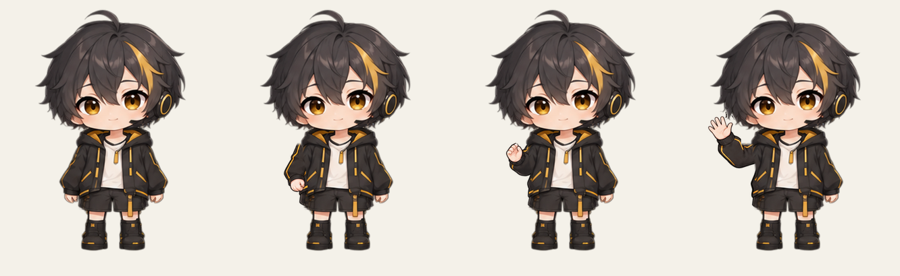
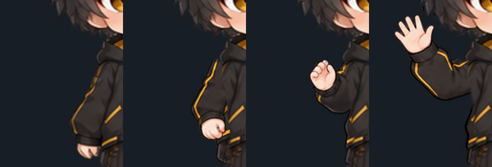

# 挥手关键帧候选

本包包含原中立图与三张新姿态，用于修复既有挥手的透明手掌、重影和角色重绘问题。技术检查通过，但肩部衔接仍未达到美术标准，整体拒收；没有补帧、运行时接入或生产部署。

## 查看候选

姿态按中立、低位准备、胸前中间姿态、外侧张掌排列：





准备和张掌的肩部衣袖轮廓与金线连接仍突兀。首批准备过高、张掌过近头发的来源已排除，保存在 `generated/rejected/`，不进入 `keys/`。中间姿态由收拢手型转为张掌，仍需补一个真实展开手掌的关键姿态，不能直接把大跨度交给补帧器。

## 来源和处理

本轮使用内置 imagegen 参考编辑五次，不使用额外图像 API；完整提示词、每次引用和输出见 `prompts.json`。动作文本计划复用已有缓存，没有新增 DeepSeek 请求。本组不是 ComfyUI 或 ControlNet 出图，也没有执行 RIFE。

选用三张 1254px 真透明来源，在同一比例下缩放到 768px，再以鞋底中点登记。原版头脸、领口、躯干中间和脚部由固定像素保护；仅活动手臂使用新图区域，最终导出完整人物 PNG。所有成图保留 20% 安全留白，脚底锚点为 384/608，不逐帧缩放或整图左右位移。

## 检查和下一步

`review/automatic.json` 保存技术测量；`review/visual.json` 绑定有序像素摘要并保持 `REJECTED`。自动报告不具有发布效力，旧 v6 样片的所有者确认也不能复用到本包。

先修准备/张掌肩部并增加手掌展开姿态，再重新检查浅/深底与放大线条。关键帧通过后才传播中间图，逐张检查 alpha、肤色、双轮廓及首尾中立，再看正常/半速整段播放。本包只有三张新姿态，不是已完成的 15fps 动画。

重建联系表和技术报告：

```powershell
node scripts/prepare-wave-keyframes-v7.mjs
node --test scripts/animation/wave-keyframes.test.mjs
```

重建后如果图像摘要变化，旧视觉报告即失效；必须重新检查，不能直接修改为通过。当前 ComfyUI 保持停止，因为系统盘约 7.0GiB 空闲，低于本机 8GiB 保护阈值。没有改变虚拟内存设置或删除用户文件。
