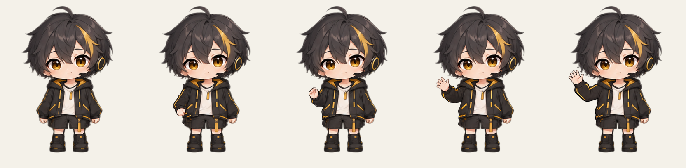

# 挥手关键帧和补帧审查

本包修整了准备和张掌的肩部连接，增加了手掌展开姿态，并测试两种本地补帧方式。五张关键姿态通过仅限补帧的美术检查，但两组完整动画仍有残影和透明度问题，整体拒收，未接入或部署。

## 素材和工具

五张姿态包括原中立、修订准备、复用的胸前姿态、新展开手掌和修订张掌。本轮内置 imagegen 参考编辑五次，选用三张新图；初次张掌人物被放大、初次展开手掌与原头发重叠，均保留来源并排除。完整实际提示词和引用在 `prompts.json`。没有额外图像 API 或新增 DeepSeek 调用。

原始生成图为 1254px，统一缩放与鞋底登记后输出 768px 完整人物 PNG，保留 20% 留白；头脸、躯干中间和靴子保护为原版像素，不是运行时分层拼装。



`review/key-visual.json` 的许可只绑定这五张成图，不能放行其他帧。旧 v7 拒收记录和生产 v6 所有者确认均不变。

## 两组补帧结果

两组均为 33 张 PNG、约 15fps，抬手再收回约 2.14 秒，末张原中立停留约 0.86 秒，共 3 秒。没有新增左右摆掌过程，不改生产动作时长。插值图、反向播放和中立停顿不算独立绘制；本组仅五张独立姿态，本轮新制作三张。

- `frames/` 使用本地 RIFE 的 RGB 和独立 alpha 两次推理。6/26 等帧有明显衣袖残影，张掌指尖仍有灰色边缘，技术检查有四帧未通过。
- `matte-frames/` 只做一次绿幕 RIFE，再用来源调色板拟合透明度，避免两次推理选择不同运动。指尖灰边有所减少，但 6/26 帧仍有下方前臂残影，多个过程帧出现部分透明肤色；技术检查有十五帧未通过。

技术与人工结论分别在 `review/interpolation.json`、`review/matte-interpolation.json` 和 `review/visual.json`。技术指标不能识别所有衣袖残影，美术拒收有独立效力。不得强制把半透明皮肤改为不透明来掩盖错误，也不通过删除问题帧或增加 fps 宣称修复。

所有 RIFE 临时文件和浏览器临时目录放在 D 盘。执行前检查 C 盘至少 8GiB、空闲内存至少 4GiB，ComfyUI 保持停止；推理按颜色/alpha顺序执行，不并行挤占资源。

## 清理和查看

按用户授权清理 npm 内容缓存与本仓库 `.next/cache`，约释放 1.3GiB。清理后 C 盘约 8.25GiB，样片制作后约 8.2GiB。完整 `.next` 含指向依赖的链接，因此没有递归删除该目录；源码、个人文件、密钥和系统设置未动。摘要及第二次清理报告位置见 `review/disk-recovery.json`。

打开 `preview.html` 可离线查看、逐帧、暂停、半速及切换浅深底。Edge本地回环预览已检查每组33帧的固定区域、播放/暂停、半速、减少动态效果和390px无横向溢出，没有外部请求。浏览器像素读回使用适合频繁读取的画布；透明边缘允许一个预乘颜色量化单位、alpha严格一致，原PNG字节另作零容差检查。实际结果见 `review/playback.json`。这些是功能预览，不是整段美术或生产验收。

重建时使用本机 Node，不在云服务器执行：

```powershell
node scripts/prepare-wave-keyframes-v8.mjs
node scripts/interpolate-wave-v8.mjs
node scripts/interpolate-wave-v8.mjs --single-matte
node scripts/preview-wave-v8.mjs
```

补帧入口要求关键帧的实际有序像素摘要与美术许可一致。前两个补帧命令当前会在生成拒收报告后返回非零退出码；这是有效门禁，不应改成成功退出。重做关键帧会使旧许可失效，必须重新看图。

下一步在低位准备与胸前姿态之间增加真实关键图，并进一步验证一致的颜色/透明度传播。全部过程帧、正常与半速播放通过新审查之后，才接入生产；本地预览不代表新发布授权。
